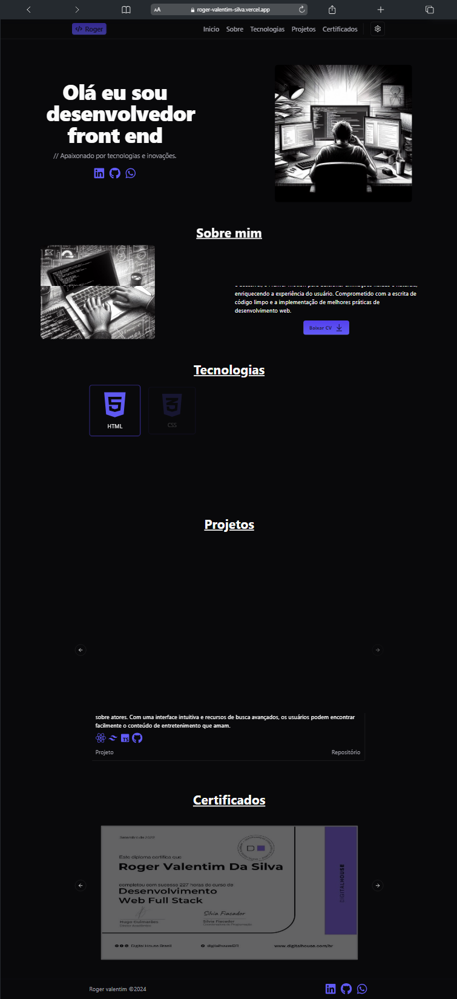

# Roger Valentim - Portfólio

## 💻 Deploy

<a href="https://rogervalentim.vercel.app/">Clique aqui para ver o projeto</a>

## 📝 Descrição

Bem-vindo ao meu portfólio!

Este espaço é dedicado a apresentar os projetos e habilidades que venho desenvolvendo ao longo do tempo. Estou continuamente atualizando esta coleção para incluir novos trabalhos e aprimorar os existentes, refletindo meu crescimento e aprendizado constante na área. Aqui, você encontrará uma variedade de projetos que demonstram minha paixão, criatividade e competência em desenvolvimento front end.

## 🔧 Instalação

Instalação com npm

```bash
  git clone "https://github.com/rogervalentim/roger-valentim.git"
  cd roger-valentim
  npm install
```

## 🔌 Como Rodar

```bash
  npm run dev
```

## 📊 Tecnologias e libs utilizadas

<ul>
<li>React</li>
<li>Context API</li>
<li>Tailwind Css</li>
<li>Shadcn UI</li>
<li>Typescript</li>
<li>I18n</li>
<li>Lucide React</li>
</ul>

## 📸 Imagem do projeto


